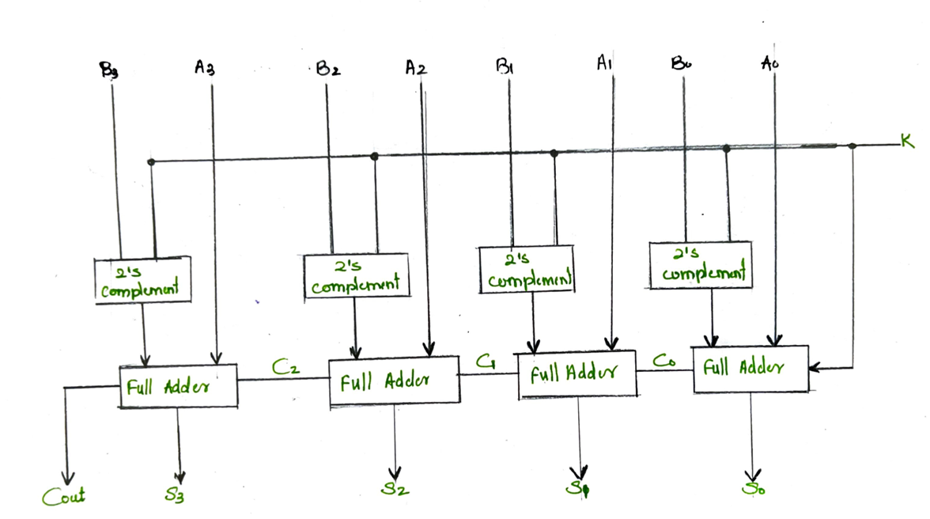
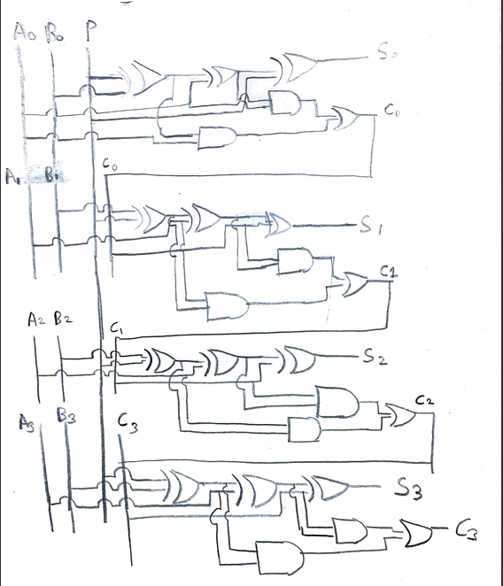
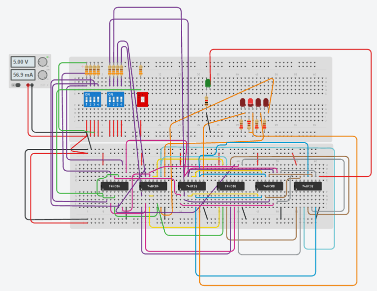
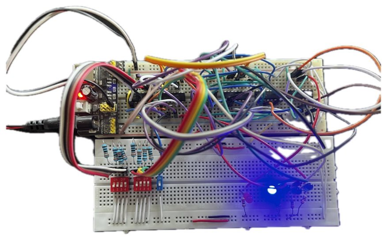

# 4-Bit Binary Adder-Subtractor Using Discrete Logic Gates

A hardware implementation of a 4-bit binary adder-subtractor built entirely from discrete 74xx series logic ICs — no microcontroller involved. The circuit adds or subtracts two 4-bit binary numbers based on a mode-select input, using the standard XOR-controlled two's complement technique.

This was built as a first-year course project for the Digital Logic Design course at university.

## How It Works

The circuit is a cascade of 4 full adders, each built from XOR, AND, and OR gates. A single control line (`M`) determines the operation:

- **M = 0** → Adder mode: `A + B`
- **M = 1** → Subtractor mode: `A - B` (via two's complement — each bit of B is XORed with M, and M feeds in as the initial carry-in)

Inputs A and B are set via DIP switches, the mode is selected via a switch, and the 4-bit sum/difference along with the carry-out is displayed on LEDs.

### ICs Used
- 74HC86 (Quad XOR) — 3x
- 74HC08 (Quad AND) — 2x
- 74HC32 (Quad OR) — 1x

## Block Overview

A high-level view of how the 4 full-adder stages are cascaded, with 2's complement blocks on the B inputs controlled by the K line to switch between add and subtract modes. *(Placeholder diagram — will be redrawn.)*

## Logic Design

Hand-drawn full-adder cascade showing how the 4 single-bit adder stages are chained together with carry propagation, and how the XOR gates on the B inputs (controlled by M) toggle the circuit between add and subtract modes.

For a detailed breakdown of the underlying theory and circuit design, see the GeeksforGeeks reference article on the [4-bit Binary Adder-Subtractor](https://www.geeksforgeeks.org/digital-logic/4-bit-binary-adder-subtractor/).

## Simulation

Before building the physical circuit, the design was simulated in Tinkercad using only logic gates (no adder ICs). You can open the simulation, poke around the wiring, and run it yourself:

**[Try the live Tinkercad simulation](https://www.tinkercad.com/things/jkdKsWbRilo-4-bit-adder-subtractor-usingonly-logic-gates)**

## Physical Build

The final circuit assembled on a breadboard, wired up with DIP switches for inputs and LEDs for output/carry indication.

## Bill of Materials

| Component | Quantity |
|---|---|
| 74HC86 (Quad 2-input XOR) | 3 |
| 74HC08 (Quad 2-input AND) | 2 |
| 74HC32 (Quad 2-input OR) | 1 |
| DIP switches (for A, B, M inputs) | 3 |
| LEDs (sum bits + carry-out) | 5 |
| Resistors (LED current limiting) | 5 |
| Breadboard | 1 |
| 5V power supply | 1 |
| Jumper wires | as needed |

## References

- [GeeksforGeeks – 4-Bit Binary Adder-Subtractor](https://www.geeksforgeeks.org/digital-logic/4-bit-binary-adder-subtractor/)
- [Tinkercad Simulation – 4-Bit Adder-Subtractor Using Only Logic Gates](https://www.tinkercad.com/things/jkdKsWbRilo-4-bit-adder-subtractor-usingonly-logic-gates)

## Context

Built as a first-year (FY) course project for a Digital Logic Design course.
